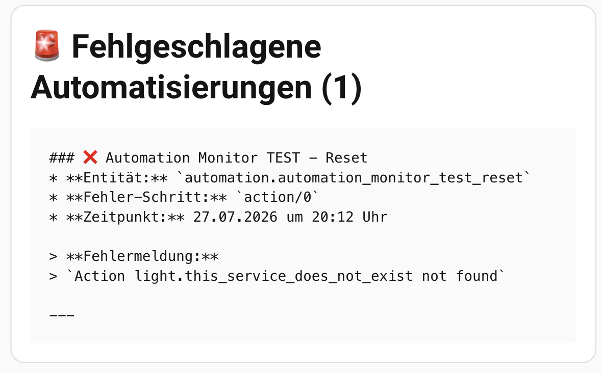
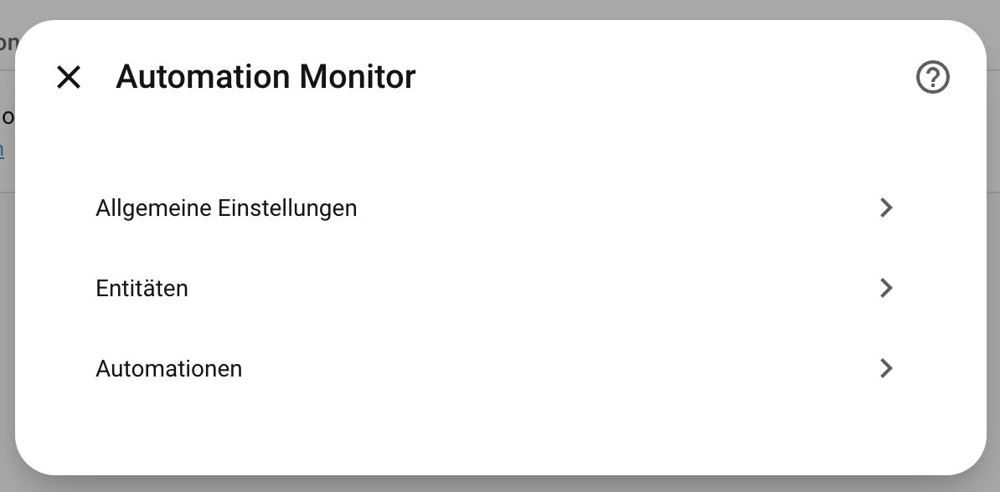
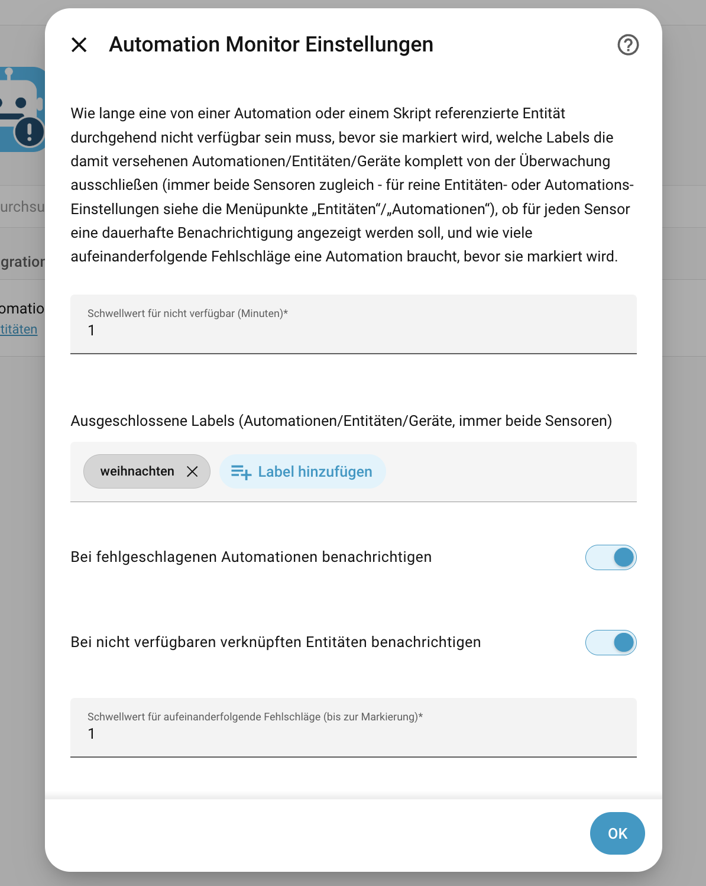
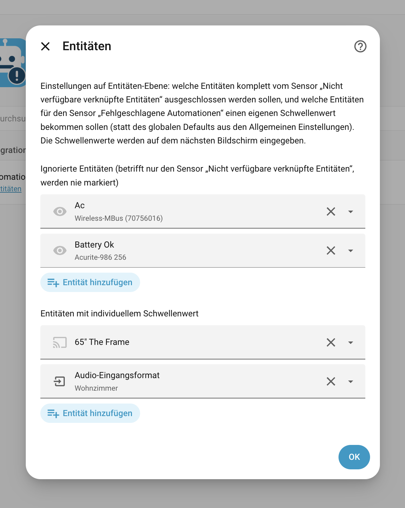
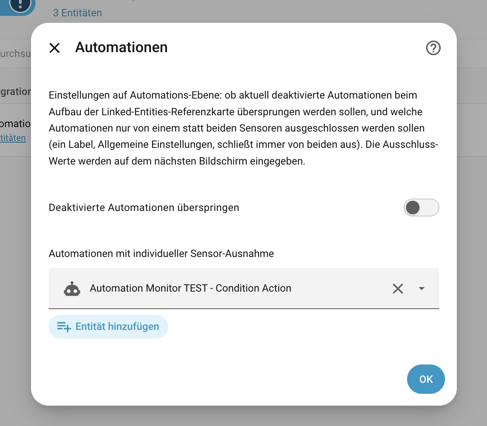
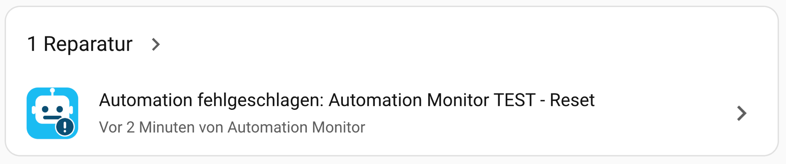
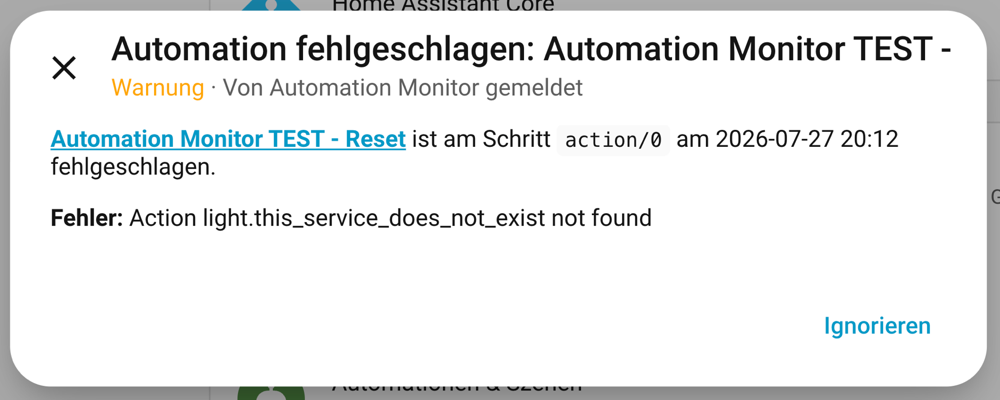

# Automation Monitor

<p align="center">
  
</p>

[](https://github.com/hacs/integration)
[](https://github.com/olli-dot-dev/ha-automation-monitor/releases)


A lightweight Home Assistant custom integration (HACS) with two structured
sensors: one detects failed automation runs from trace data, the other
proactively flags entities referenced by your automations/scripts/scenes
that are stuck `unavailable` - a failure mode the trace-based sensor cannot see at
all (see Linked entity unavailability detection). Optional Repairs issues,
toggled independently per sensor (see Repairs issues), plus Logbook/Activity
history for both, on by default (see Logbook) - no dashboard card,
no retention logic beyond that. Detection and structured exposure is the
focus; how you display or act on the data (Markdown card, `auto-entities`,
your own automations, ...) is up to you.



See [CHANGELOG.md](CHANGELOG.md) for release notes.

Complementary to [Watchman](https://github.com/dummylabs/thewatchman),
which checks *statically* for missing entities/services in your config.
Automation Monitor covers the other half: *runtime* errors when an
automation actually runs.

## In plain terms

Two different things can go wrong with an automation, and this
integration watches for both:

1. **"It ran, and it broke."** Your automation actually fired, and
   something inside it went wrong (a light didn't respond, a step threw
   an error). Like turning a car's key and hearing the engine cough.
   → watched by **`sensor.failed_automations`**.
2. **"It's already broken, waiting to happen."** A light, switch, or
   other device your automation *uses* has gone offline - but no
   automation has tried to use it yet, so nothing has failed *yet*.
   Like a flat tire on a parked car: broken right now, you just haven't
   driven anywhere to notice.
   → watched by **`sensor.linked_entities_unavailable`**.

Each is its own sensor, and they run completely independently of each
other - use either one on its own, or both together:

| Sensor | Catches | Example |
| --- | --- | --- |
| `sensor.failed_automations` | An automation ran and something in it errored out | A script step calls a service that fails |
| `sensor.linked_entities_unavailable` | A device an automation *would use* is offline, whether or not that automation has run | A Zigbee light drops off the network |

Both show up as data (a sensor with a list), not as a fix. This
integration never changes anything in your house - it only watches and
reports. What you do with that report (a notification, a dashboard, a
follow-up automation) is entirely up to you.

**What this can't do:** it can't catch a mistake *before* you save it
(a typo'd device name, a setting that doesn't exist) - that's a config
check, and HA's own Settings → System → Repairs (or the separate
Watchman add-on) already does that well. This integration only speaks
up once something has actually gone wrong, or is already sitting broken.

## Why not just use Watchman / HA's built-in Repairs?

Both check for problems *before* you run into them, but only for
**static** config mistakes (a typo'd service name, a missing entity) -
the same category [Watchman](https://github.com/dummylabs/thewatchman)
covers. Automation Monitor is for the other half: problems that only
show up at **runtime**, with a perfectly valid config - a template that
hits `None` depending on live state, a deliberate `stop: ... error: true`,
a cloud integration failing due to its own backend issues. See
[TECHNICAL.md](TECHNICAL.md#why-not-just-use-watchman--has-built-in-repairs)
for the full comparison, including how this integration's own optional
Repairs issues (see Repairs issues below) differ from HA's static ones.

## Requirements

- Home Assistant 2024.1 or newer
- [HACS](https://hacs.xyz/) installed (for the HACS installation method below;
  not required for a manual install)

## Installation

Not yet published to the default HACS store - install via a custom
repository for now.

### One-click (recommended)

[](https://my.home-assistant.io/redirect/hacs_repository/?owner=olli-dot-dev&repository=ha-automation-monitor&category=integration)

Click the badge above to add this repository to HACS directly - it handles adding the custom repository and finding the integration for you. Then click **Download** and restart Home Assistant.

### Via HACS (custom repository, manual)

1. Open HACS in your Home Assistant sidebar
2. Go to **⋮ → Custom repositories**
3. Add `https://github.com/olli-dot-dev/ha-automation-monitor` with category **Integration**
4. Find **Automation Monitor** in the HACS integration list and click **Download**
5. Restart Home Assistant

### Manual

1. Copy the `custom_components/automation_monitor` folder into your HA `config/custom_components/` directory
2. Restart Home Assistant

## Setup

After installation and restart:

1. Go to **Settings → Devices & Services → + Add Integration**
2. Search for **Automation Monitor** and click it
3. Confirm - no configuration needed to enable it

Both `sensor.failed_automations` and `sensor.linked_entities_unavailable`
appear immediately. To change any setting afterward, open the
integration's entry and click **Configure** (see Configuration).

## Usage

Both sensors work passively once installed - there's nothing to trigger
manually day to day:

- **`sensor.failed_automations`** reflects currently-failing automations in
  its `automations` attribute; see Recommended display / Recommended
  notification automation below for ready-to-use ways to surface it on a
  dashboard or as a notification
- **`sensor.linked_entities_unavailable`** reflects entities referenced by
  your automations/scripts/scenes that have been unreachable past the
  configured threshold, in its `entities` attribute
- Call `automation_monitor.reset` to clear a stuck failure entry without
  waiting for a restart or a successful re-run (see Actions)
- Call `automation_monitor.rebuild_linked_entities` right after editing a
  script's content, to pick up the change immediately instead of waiting
  for the periodic safety-net rebuild (see Actions)
- **A Home Assistant restart resets both sensors** - no persistence
  across restarts, by design. `sensor.failed_automations` starts empty
  (only reacts to a fresh trigger, not whatever was already broken
  before). For `sensor.linked_entities_unavailable`, a device that's been
  broken for days typically needs to wait out the full threshold *again*
  after a restart, since most entities get a fresh timestamp from their
  own integration when HA starts up.

## Failure classification

Only genuine runtime errors count as "failed" - read as HA's trace
`script_execution` result, not string-matched log text. A mid-run
`condition:` action not being met is *not* a failure (intended
behaviour); a `stop: ... error: true`, an unhandled exception, or a step
that used `continue_on_error: true` to swallow a real error all *are*.
See [TECHNICAL.md](TECHNICAL.md#failure-classification) for the full
`script_execution` value table and the reasoning behind each one -
including why this needed live testing to get right, since a first
attempt at telling "intended stop" and "real abort" apart from the trace
data alone turned out to be wrong.

Classifying a run as a failure doesn't necessarily flag it right away: a
second, independent setting - the failure streak threshold (default 1,
i.e. flag on the very first failure) - decides how many *consecutive*
failures an automation needs before `sensor.failed_automations` actually
reports it, with an optional per-entity override for particularly flaky
devices. See Configuration.

Uses HA's trace API rather than parsing log messages (fragile - free
text, language-dependent, changes between HA versions) - see
[TECHNICAL.md](TECHNICAL.md#data-source) for how that's implemented and
what to check first if this breaks on a future HA version.

## Linked entity unavailability detection

A second, independent sensor for a failure mode the trace-based sensor
above cannot see at all: a service call targeting an entity that's
currently `unavailable` (e.g. an unresponsive Zigbee/Wi-Fi device) is
silently skipped by HA's core service dispatch, with no trace error, log
warning, or other signal. This sensor takes a proactive approach instead
of waiting for an automation to run and fail: it finds every entity
referenced by your automations, scripts, and scenes, watches their
state, and flags any that have been continuously `unavailable` (**not**
`unknown` - that's often legitimate, e.g. right after a restart) for
longer than a configurable threshold (default 15 minutes).

See [TECHNICAL.md](TECHNICAL.md#linked-entity-unavailability-detection-mechanism)
for exactly how entities are resolved (including device/area targets),
how the reference map stays fresh, and the reasoning behind each
Configuration option below.

## Configuration

Click **Configure** on the integration's entry (Settings → Devices &
Services → Automation Monitor) to open a three-way menu:



### General settings

Settings that aren't clearly entity- or automation-specific: the
`linked_entities_unavailable` threshold (see Linked entity unavailability
detection), excluded labels (affects *both* sensors at once - see below
for how that differs from the entity-/automation-specific settings),
whether to open a Repairs issue per sensor (see Repairs issues), and the
global failure streak threshold (see Failure classification).



### Entities

Entity-level settings - picked here, values entered on a second screen
since HA's selectors have no single widget for "entity + number":



- **Ignored entities** - only affects `sensor.linked_entities_unavailable`
  (see Linked entity unavailability detection)
- **Entities with an individual streak threshold** - only affects
  `sensor.failed_automations`: overrides the global default from General
  settings for automations that touch this specific entity - useful for
  one specific flaky device (e.g. a Zigbee mesh outlier) without raising
  the threshold for every automation. See
  [TECHNICAL.md](TECHNICAL.md#per-entity-streak-threshold-override) for
  matching details and what happens with multiple overrides.

### Automations

Automation-level settings, same picker-then-detail-screen shape as
Entities above:



- **Skip automations that are turned off** - only affects
  `sensor.linked_entities_unavailable` (see Linked entity unavailability
  detection)
- **Automations with individual per-sensor exclusion** - pick automations
  here, then choose on the next screen which sensor(s) each one should be
  excluded from. Unlike an excluded label (General settings, always
  excludes from *both* sensors), this lets an automation be excluded from
  just one - e.g. a known-flaky automation excluded from
  `sensor.failed_automations` while its referenced entities are still
  tracked by `sensor.linked_entities_unavailable` (other automations may
  reference the same entities).

## Repairs issues

Two independent toggles under General settings (see Configuration), off
by default: one for `sensor.failed_automations`, one for
`sensor.linked_entities_unavailable`. Enable either, both, or neither -
they don't affect each other.

Shows up under **Settings → System → Repairs** - admin-only, unlike the
persistent (bell-icon) notification this replaced (that HA component has
no per-user/admin targeting at all - see
[TECHNICAL.md](TECHNICAL.md#repairs-issues-internals) for why that
mattered enough to migrate away from entirely).



One issue per currently-failed automation / currently-unavailable linked
entity - not one combined card the way the old notification worked.
Matches how the Repairs page already presents multiple issues as
separate, individually-dismissible rows:

- Created the moment an automation/entity is flagged, updated in place on
  every subsequent failure (fresh error message/timestamp - the issue_id
  stays the same, so it's the same row, not a new one piling up), and
  automatically deleted once it resolves: a successful run, the entity
  becoming available again, or the `reset` action clearing it (see
  Actions).
- Opening an issue shows the full detail, including a clickable link
  straight to the automation editor (or, for a linked entity, its device
  page) and, for a linked entity, which automation(s)/script(s)
  reference it:

  

- Turning a toggle off clears every open issue for that sensor
  immediately, even if some were currently open.
- Saving *any* option (even an unrelated one, like the threshold) does
  **not** clear already-open issues that are still genuinely true -
  each sync only touches issues under its own sensor's prefix, diffing
  against what the sensor currently reports rather than clearing
  everything and starting over.
- **"Ignorieren"/"Ignore" on an issue** hides it from the main Repairs
  list without deleting anything, and - unlike you might expect - it
  *stays* hidden even through repeated updates of the same problem (fresh
  error message/timestamp on each new failure). It only reappears once
  the issue is actually deleted and later re-created from scratch, i.e.
  the automation/entity has to genuinely recover at least once before
  failing again. See
  [TECHNICAL.md](TECHNICAL.md#what-ignorierenignore-on-an-issue-actually-does)
  for how that's verified against HA's own source.

Severity is always `warning` (not `critical`) - a real problem worth
looking at, but not something that took HA itself down. Detection only,
same as the sensors: no "fix" flow is offered, the issue is just a
pointer to the same underlying problem the sensor already tracks - go
use the editor link, fix the automation/device, and the issue clears
itself once resolved.

This is meant for a quick, always-on-if-you-want-it admin view, not a
push alert to your phone - for that, see Recommended notification
automation below, which you can run alongside these toggles (they don't
conflict; one opens a Repairs entry, the other fires a one-off push
notification per new failure).

## Logbook

Both sensors fire an entry to HA's built-in **Settings → Activity** page
(called **Logbook** in older HA versions - the sidebar entry was renamed
to "Activity"/"Aktivität" in a more recent frontend release; the
underlying page and URL are still `logbook`) once per genuine
flag/resolve *transition* - not on every repeated update of an
already-open issue, so it reads as real history rather than noise:

- `sensor.failed_automations`: "**\<name\>** failed: \<error message\>" /
  "**\<name\>** recovered"
- `sensor.linked_entities_unavailable`: "**\<name\>** became unavailable
  (referenced by an automation/script/scene)" / "**\<name\>** became
  available again"

On by default and independent of the Repairs-issue toggles above (General
settings) - you can have Activity history without Repairs pop-ups, or the
other way around. No configuration, same as HA's own built-in
`automation_triggered` Logbook entries.

## Language

English, German, French and Spanish (`en`/`de`/`fr`/`es`) so far - German
was added first, requested by a German-speaking user who found the
(English-only, at the time) notifications hard to follow. Automatically
follows HA's own system language (Settings → System → General →
Language, `hass.config.language`) - nothing to configure. Falls back to
English for any other language.

Entity names, the Options dialog, and Repairs issue titles/descriptions
all go through HA's own built-in translation system - nothing special
here, even though Repairs issue text is generated at runtime from live
data (error message, timestamp, link) rather than static form text. See
[TECHNICAL.md](TECHNICAL.md#language-mechanism) for how that works and
why it replaced an earlier hand-rolled approach. Entity/automation
*names* and error messages themselves are never translated (they're your
own data, or another integration's error text).

Adding another language: add `translations/<lang>.json` mirroring
`translations/en.json` - covers entity names, the Options dialog, and
Repairs issue text together, no separate mechanism to update.

## Actions

`automation_monitor.reset` clears currently tracked failures without
waiting for a restart or for each automation to succeed again - also
resets its consecutive-failure streak count (see Configuration /
Failure classification) back to zero, so it doesn't immediately re-flag
itself on the next failure:

- No target: clears all currently tracked failures.
- `entity_id: automation.xyz`: clears only that automation's entry, if present.

`automation_monitor.rebuild_linked_entities` immediately rebuilds the
automation/script/scene → referenced-entity map used by the
linked-entities sensor, instead of waiting for the periodic 20-minute
safety-net rebuild. No target/fields - useful right after editing a
script's or scene's content (see Linked entity unavailability detection
for why scripts and scenes specifically need this).

## Updating

Installed via HACS (recommended, see Installation)? HACS creates its own
update entity for every repository it manages, custom repositories
included - look for an entity along the lines of
`update.automation_monitor_update` (exact name may vary), which can
actually install the new version, unlike a from-scratch GitHub-polling
entity this project used to ship (removed in v0.9.0 for exactly this
reason - see CHANGELOG). You can also just check the HACS panel itself.

Installed manually (no HACS)? There's no automatic update detection at
all - watch the [Releases page](https://github.com/olli-dot-dev/ha-automation-monitor/releases)
or [CHANGELOG.md](CHANGELOG.md), and repeat the Manual installation steps
with the new version when you want to update.

## Recommended display (documentation only, not part of the integration)

```yaml
type: markdown
content: >
  
  **{{ a.name }}** - {{ a.last_error_time }}
  {{ a.error_message }}

  
```

A more detailed variant, shared by community member ArnaudFeld
([smarterkram.de forum](https://community.smarterkram.de/t/automation-monitor-neue-hacs-integration-fuer-fehlgeschlagene-automationen/551/8)) -
a heading with the current failure count, one block per failed automation
(name, entity_id, error step, formatted timestamp, error message), and a
success message when there's nothing to report:

```yaml
type: markdown
content: >
  
  
  
    # 🚨 Fehlgeschlagene Automatisierungen ({{ failed_list | length }})

    
      ### ❌ {{ item.name }}
      * **Entität:** `{{ item.entity_id }}`
      * **Fehler-Schritt:** `{{ item.error_step }}`
      * **Zeitpunkt:** {{ as_timestamp(item.last_error_time) | timestamp_custom('%d.%m.%Y um %H:%M Uhr') }}

      > **Fehlermeldung:**
      > `{{ item.error_message }}`

      ---
    
  
    # ✅ Automatisierungs-Monitor

    🎉 **Alles super!** Aktuell wurden keine fehlerhaften Automatisierungen erfasst.
  
```


Same pattern for the linked-entities sensor, using its `entities` attribute:

```yaml
type: markdown
content: >
  
  **{{ e.name }}** - unavailable since {{ e.unavailable_since }}
  Used by: {{ e.referenced_by | join(', ') }}

  
```

## Recommended notification automation (documentation only, not part of the integration)

Want a push notification to your phone instead of (or alongside) the
built-in Repairs-issue toggles from Repairs issues above? Use this - a
Repairs issue is admin-only and lives in Settings → System → Repairs,
not something that pushes to your phone. Fires only when the failure
count *increases* (a genuinely new failure),
not on every state write and not when the count drops from a reset or a
retry succeeding. Diffs the `automations` list against its previous value
so the notification only covers the newly-added entries, even if several
failures land in the same update.

```yaml
triggers:
  - trigger: state
    entity_id: sensor.failed_automations
condition: >
  {{ trigger.to_state.state | int(0) > trigger.from_state.state | int(0) }}
actions:
  - variables:
      previous_ids: >
        {{ trigger.from_state.attributes.automations
           | default([]) | map(attribute='entity_id') | list }}
      new_failures: >
        {{ trigger.to_state.attributes.automations
           | rejectattr('entity_id', 'in', previous_ids) | list }}
  - repeat:
      for_each: "{{ new_failures }}"
      sequence:
        - action: notify.notify  # replace with your actual notify target, e.g. notify.mobile_app_your_phone
          data:
            title: "Automation failed: {{ repeat.item.name }}"
            message: >
              {{ repeat.item.error_message }}
              ({{ repeat.item.error_step }}, {{ repeat.item.last_error_time }})
mode: queued
```

Replace `notify.notify` with a specific notify target (e.g.
`notify.mobile_app_your_phone`). `mode: queued` so that failures arriving
in quick succession each still get their own notification instead of
cancelling one another.

## Contributing

See [TECHNICAL.md](TECHNICAL.md) for implementation notes and
internal-HA-behavior verification behind the non-obvious decisions in
this codebase.

1. Fork the repository
2. Drop `custom_components/automation_monitor` into your HA `config/custom_components/`
3. Restart Home Assistant after changes to any `.py` file - reloading the
   integration from Settings → Devices & Services is **not** enough, since
   a reload re-runs the already-imported module rather than re-reading it
   from disk
4. Run `pytest` (`pip install -r requirements_test.txt` first if needed) before opening a PR
5. Open a pull request

## License

[MIT](LICENSE)
